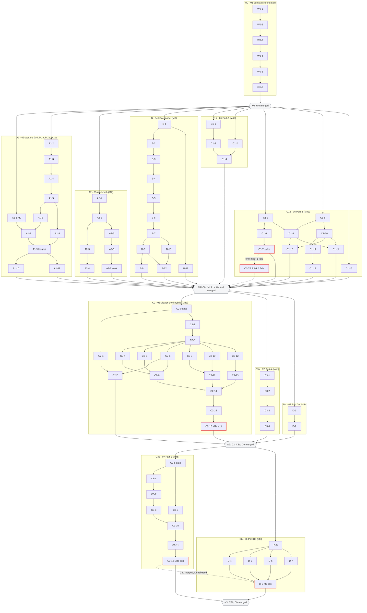

# Trace Viewer: Master Index (all lanes, waves W0–W3) Implementation Plan

> **For agentic workers:** REQUIRED SUB-SKILL: Use superpowers:subagent-driven-development (recommended) or superpowers:executing-plans to implement each lane part task-by-task. Steps use checkbox (`- [ ]`) syntax for tracking. This index holds no code steps. It orders, gates and merges the eight lane files; every TDD step lives in a lane file, and every cross-lane name and type lives in the two interface indexes.

**Goal:** Build the jevcode trace viewer (milestones M0 through M5) as eleven lane parts in four waves of parallel git worktrees, one subagent-driven controller per part, merged into `main` in a fixed order.

**Architecture:** Eight lane files hold eleven lane parts; three files (05, 07, 08) hold two parts each. The base index (`2026-09-28-trace-viewer-interfaces.md`) fixes the names, types and file ownership for W0, A1, A2 and B. The UI index (`2026-09-28-trace-viewer-interfaces-ui.md`) does the same for C1a through Db, and its §1 lists the amendments W0, A2 and B must carry. Each wave branches from the merge commit that closed the previous wave, and it merges back in the order below. That order ships behavior in the D9 milestone order: M0, M1a, M1b, M2, M3, M4a, M4b, M5.

**Tech Stack:** TypeScript 5.9 (NodeNext for packages, Bundler for the two hosts, `strict`, `verbatimModuleSyntax`, `noUncheckedIndexedAccess`), Node 22, pnpm 9.15.0 workspaces, zod 3.25.76 (zod 4.3.6 only inside `@jevcode/ui-catalog`), React 19.2.3, `@tanstack/react-virtual` 3.14.13 (virtual-core 3.17.11), Vite 5.4.21 + `@vitejs/plugin-react` 4.7.0, vitest 3.2.7 + jsdom 30.1.0 + `@testing-library/react` 16.3.3 + `@testing-library/user-event` 14.6.7, fast-check 4.10.1, better-sqlite3 11.10.0, Electron 33.4.11, ESLint 9.39 flat config, headless Google Chrome for the visual smoke.

**Spec:** `docs/superpowers/specs/2026-09-28-trace-viewer-design.md`. Binding decision record: `local decision scratchpad (not committed)` (D1–D12, R1–R29). Mockups: `docs/superpowers/specs/2026-09-28-trace-viewer-mockups/`. This index defines no names or types. For those, precedence is: the decision record, then the spec, then the base index, then the UI index, then a lane file.

## Global Constraints

Project-wide rules, with values copied verbatim from the decision record, the spec and the two interface indexes. Every lane file repeats the ones that apply to it.

- Node `>=22` (root `package.json` engines); `newId` uses `globalThis.crypto.randomUUID()` (R6). pnpm `9.15.0`.
- zod 3 only (`^3.24.1`, locked `3.25.76`) in `@jevcode/contracts` and `@jevcode/trace-viewer`; zod 4 stays inside `@jevcode/ui-catalog`.
- "Every new field OPTIONAL (rebuildSession re-parses stored rows and throws on failure, db.ts:191-197)." Never add `.strict()`.
- "exitCode stays `?? -1` in storage; the viewer renders -1 as "unknown", never failed." (R2)
- "NO SQL migration in v1." `LATEST_SCHEMA_VERSION` does not change (R5).
- The viewer never writes. `trace:*` handlers reach only a reader on its own `PRAGMA query_only = ON` connection. `ViewerHost.requestChanges` is the only outbound call, and only the Electron host implements it (R5, D9, R29).
- "packages/trace-viewer takes NO @xyflow/react dependency" (R17). The fallback is `d3-zoom` 3.0.0 behind the same controller API.
- Model (`src/model`) is React-free and hashes nothing. ESLint bans `react`, `node:*`, `electron` and `@jevcode/{storage,semantic-core,evidence-engine,jev-router,agent-*}` there (R7). `layout` imports `model`, never the reverse. `layout` never imports `ui`, React, the DOM or timers (R19).
- Stable ids: `step:<firstSeq>`, `unit:<changeUnitId>`, `decision:<decisionId>`, `file:<path>`, `finding:<ruleId>@<version>:<anchorSeq>` (R9).
- IPC bounds: `trace:listSessions {repoId?, sessionId?, limit ≤ 500}`, `trace:rows {sessionId, afterSeq?, limit ≤ 5000}`, `trace:payloads {sessionId, seqs 1–50}` (R5, spec §5.4). Strings over 16 KiB are clipped to head + tail with `clipped: true` (`TRACE_CLIP_CHARS = 16_384`).
- `git_hunk.diff {hash (16 hex), bytes, text?, truncated, redactions, withheld?: "secret_path"|"not_captured"}`. The diff text is capped at 32 KiB, cut at the last `@@` hunk boundary. `.env*`, `*.pem`, `*.key` and `id_rsa*` are withheld (R3).
- Live follow = poll `trace:rows {afterSeq}` every 1 s until `terminal(state) = state === "completed" || state === "failed"`. Reconnect backoff is 1, 2, 4, 10 s (R5, R23).
- Five v1 signals: `claim_contradicted` (critical), `failing_tests` (warning; critical if the target's final run failed), `destructive_command` (critical), `guardrail_clamp` (unknown clamp ids → info), `recovery_arc` (info) (R11).
- Light mode only. Tokens (D8, prefixed `--tv-*`): `--canvas #F4F5F7; --panel #FFFFFF; --ink #16181D; --ink-2 #5B616E; --hair rgb(16 24 40 / .07); --fill rgb(16 24 40 / .04); --fill-2 rgb(16 24 40 / .07); --accent #2F6BFF; --accent-soft rgb(47 107 255 / .10); --bad #E5484D; --bad-soft rgb(229 72 77 / .09); --good #2E9E6A`. R24 overrides: `--tv-ink-3 #676D78` for text, `--tv-ink-4 #9AA0AB` decoration only, `--tv-mark #7C828E`, `--tv-accent-ink #1F5EF0`, `--tv-bad-ink #CE2C31`. Color encodes state only.
- 12 px minimum text. System font stack; mono only for paths, commands and code. No ALL-CAPS and no eyebrow labels (D8).
- Agent-written text renders only as React text nodes. `dangerouslySetInnerHTML` appears only inside ui-catalog `CodeDiff`.
- Dependencies: every new npm dependency and every `pnpm-lock.yaml` change happen in W0-1 only. No other lane edits a `package.json` dependency block, an `exports` map, `pnpm-lock.yaml` or `eslint.config.mjs`. A task that needs one stops and escalates.
- Budgets (spec §10, R26): full soak read in main ≤ 1.5 s and `trace:rows` p95 ≤ 50 ms (M2); fold of 75k rows ≤ 500 ms and one appended row ≤ 2 ms (benchmark); soak first paint ≤ 300 ms and full load ≤ 2 s, `j` to painted p95 ≤ 16.7 ms, and overview layout + paint p95 ≤ 4 ms with ≤ 150 overlay nodes (M4a); anchor drift ≤ 1 px (smoke); `layoutCanvas` fresh ≤ 2 ms and sticky ≤ 0.5 ms (benchmark); canvas pinch at Step level ≤ 5% of frames dropped and the view switch restored in the toggle's frame (M4b); live tick p95 ≤ 16 ms, and soak open in the trace window with first paint ≤ 500 ms and full load ≤ 3 s (M5).
- Out of v1: Codex and Claude importers; dark mode; multi-agent trees; cross-session search; sharing or export outside the machine; token and cost lanes; supervisor comments; `test_weakened` and `verification_bypass`; SQL migrations, derived columns, join tables; a legacy id resolver.
- Commits: one conventional commit per task, with the task's files listed in `git add`. Never add a `Claude-Session:` trailer. Use the repository's configured git identity.
- Worktrees: never run `git stash`, because the stash stack is shared by every worktree; set work aside with a WIP commit. Create lane worktrees with `git worktree add -b`. Never use `-f`. Use `--detach` for throwaway verification worktrees.
- The shell is zsh: write `${var}:suffix`, never `"$var:suffix"`.
- Root checks, in this order, at the end of every task and before every merge: `pnpm -r build`, `pnpm -r typecheck`, `pnpm -r --no-bail --workspace-concurrency=1 test`, `pnpm lint`. Each must exit 0.

## Review Focus

These are the five cross-lane failure modes most likely to cost a wave. No single lane's tests catch them. Each line names the condition, the expected behavior and the check that pins it.

1. **UI index §1 amendments are missing from lane files 01, 03 and 04 when those lanes start, or are pasted in twice.** W0 merges as one PR. A missing `LEVELS`, `originMs`, session-bound `TraceSource`, `./sources` export, `assetsInlineLimit: 0` or `LAYOUT_PURE_GLOBALS` surfaces only when C1a and C1b check their prerequisites in W1, after W0 has merged. A second `matchSuccessClaim` or a second R25 field fails `tsc`. Expected: every count in Pre-flight Step 2 is right before W0 starts, and the W1 and W2 prerequisite greps pass at each wave's start. Pinned by: Pre-flight Step 2; the "Lane prerequisites" sections of lane files 05, 06, 07 and 08; the state table in base index §6.
2. **The trace-profile soak does not exist when M4a and M5 measure.** When lanes 06 and 08 were written, lane 03's A2-7 added only `JEVCODE_SOAK_EXPORT`. C2-16 Step 4 needs `JEVCODE_SOAK_PROFILE=trace`, and D-8 Step 1 also needs `JEVCODE_SOAK_KEEP_DB`. Expected: A2-7 implements both before A2 merges in W1, so the M4a and M5 budgets run on the spec §10 reference input and do not stop at a grep. Pinned by: lane 03 Interface deviation 14 (A2-7 now specifies both switches); Pre-flight Step 2 (lane 03 rows); C2-16 Step 4's grep; lane 08 "Required amendments to other lanes" item 1 and its Part Db prerequisites.
3. **A lane is tested against stale inputs after `git rebase main`.** Three inputs go stale. `dist` goes stale because every workspace package exports only `./dist` and desktop tests have no pretest build. better-sqlite3 is left on the Electron ABI by C1-7, C3-12, D-6, D-8 or A2's boot smoke. Fixture lines change when A1-9 lands. Expected: every rebase is followed by `pnpm install --frozen-lockfile && pnpm -r build`. Every Electron run ends with `pnpm --filter jevcode-desktop rebuild:node`. Tests locate fixture rows by content. A failure after a rebase is fixed in the rebasing lane's own test, never by editing fixtures or another lane's file. Pinned by: Merge procedure steps 2–4; the exit sections of lanes A2, B, C1a and C1b.
4. **Records that one lane writes and a later lane reads.** The spike (C1-7) records rulings that C1-7F (W1), C2-5 and C2-11 (W2), and C3-5 (W3) apply. D-8 copies the "M4a exit" section (C2-16) and the "M4b exit" section (C3-12) into `docs/perf.md`. Expected: the C2-0 and C3-5 gates find a pass or a ruling for each of their risks. D-8 starts only after C3b has merged and Db has rebased onto it, so no budget row reads "not recorded at M4a/M4b". Pinned by: C2-0; C3-5; lane 05 "Lane C1b completion"; D-8 Step 4; Execution Step 6.
5. **Two controllers work from one plan file, and some files are shared across lanes.** Lane files 05, 07 and 08 hold two lane parts each. A controller started in the main checkout, or started without its part scope, shares a ledger with the other part or dispatches the other part's tasks. `git stash` in any worktree writes to the one shared stash stack. Append-only shared files conflict at rebase: `docs/spikes/trace-viewer-spike.md`, `packages/trace-viewer/src/index.ts`, `docs/perf.md` and `docs/SPEC.md`. Expected: each controller runs `sdd-workspace` from inside its own worktree, writes its part scope on line 2 of its ledger, and executes only its own task ids. A rebase conflict in a shared file keeps both sides. Pinned by: Execution Steps 3–5; the shared-file tables in base index §4 and UI index §4.

---

## 1. Lane parts

"Depends on" names what must be merged into `main` before the part's worktree is created. Inside a part, tasks run in file order. The task-level graph is in section 3.

| Lane part | File | Part | Tasks | Milestone | Wave | Depends on |
|---|---|---|---|---|---|---|
| W0 contracts foundation | [01-contracts-foundation](2026-09-28-trace-viewer-01-contracts-foundation.md) | whole file | W0-1 to W0-6 | Contracts for M1–M5 (M1's first PR; SPEC §18 sign-off edit) | W0 | Pre-flight (section 4) |
| A1 capture | [02-capture](2026-09-28-trace-viewer-02-capture.md) | whole file | A1-1 to A1-11 | M0 (A1-1), M1a (A1-2 to A1-4), M1b (A1-5 to A1-9), M1c (A1-10, A1-11) | W1 | W0 |
| A2 read path | [03-read-path](2026-09-28-trace-viewer-03-read-path.md) | whole file | A2-1 to A2-7 | M2 | W1 | W0 |
| B trace model | [04-trace-model](2026-09-28-trace-viewer-04-trace-model.md) | whole file | B-1 to B-12 | M3 | W1 | W0 |
| C1a visual primitives | [05-viewer-foundation](2026-09-28-trace-viewer-05-viewer-foundation.md) | Part A | C1-1 to C1-4 | M4a | W1 | W0 (with UI index §1.1, §1.2) |
| C1b viewer core + spike | [05-viewer-foundation](2026-09-28-trace-viewer-05-viewer-foundation.md) | Part B | C1-5 to C1-15; C1-7F only if spike risk 1 fails | M4a (spike, first day) | W1 | W0 (with UI index §1.1, §1.2) |
| C2 shell + Hybrid | [06-viewer-shell-hybrid](2026-09-28-trace-viewer-06-viewer-shell-hybrid.md) | whole file | C2-0 to C2-16 | M4a | W2 | W1 (all five parts; B with UI index §1.4) |
| C3a canvas layout | [07-canvas-view](2026-09-28-trace-viewer-07-canvas-view.md) | Part A | C3-1 to C3-4 | M4b | W2 | W1 |
| Da Electron main | [08-electron-live](2026-09-28-trace-viewer-08-electron-live.md) | Part Da | D-1, D-2 | M5 | W2 | W1 (A2 with UI index §1.3) |
| C3b Canvas view + switch | [07-canvas-view](2026-09-28-trace-viewer-07-canvas-view.md) | Part B | C3-5, C3-9, C3-6, C3-7, C3-8, C3-10, C3-11, C3-12 (file order) | M4b | W3 | W2 |
| Db trace window + live | [08-electron-live](2026-09-28-trace-viewer-08-electron-live.md) | Part Db | D-3 to D-8 | M5 | W3 | W2; D-8 also needs C3b merged |

## 2. Waves and merge order

`<w0>`, `<w1>` and `<w2>` are the SHAs that `git -C ~/Projects/jevcode rev-parse main` prints right after each wave's last merge. Lane 08 writes `main` for the same commit. The reasons behind each placement are in base index §4 and UI index §4.

| Wave | Lane parts (in parallel) | Base | Merge order | The wave closes when |
|---|---|---|---|---|
| W0 | W0 | `main` (`144c7fb` plus docs-only commits) | W0 | W0 is merged; record `<w0>` |
| W1 | A1, A2, B, C1a, C1b | `<w0>` | A1 → A2 → B → C1a → C1b | C1b is merged with a ruling for all seven spike risks; record `<w1>` |
| W2 | C2, C3a, Da | `<w1>` | C2 → C3a → Da | Da is merged; the M4a exit is recorded; record `<w2>` |
| W3 | C3b, Db | `<w2>` | C3b → Db | Db is merged; the M4b and M5 exits are recorded |

A part that finishes before its predecessor in the merge order waits for it. After a predecessor merges, the next part rebases, rebuilds and reruns its checks (section 7). R1 wants M0 as "separate small PR, before M1b". A1-1 Step 7 marks `tv/a1-m0-db-modes` for that. If the person wants the separate PR, merge that branch before `tv/a1-capture`; the later rebase then starts after the M0 commit.

## 3. Task dependency graph

Solid arrows are the "Depends on" columns of base index §3 and UI index §3. Hexagons are wave merges. Dashed arrows are conditional or cross-lane ordering. Red outlines mark tasks with a HUMAN CHECK (section 8).



## 4. Pre-flight (once, before W0)

- [ ] **Step 1: Confirm the base**

Run: `git -C ~/Projects/jevcode diff --stat 144c7fb main -- . ':(exclude)docs/superpowers'`
Expected: no output.

Run: `git -C ~/Projects/jevcode status --short --untracked-files=no`
Expected: no output (the main checkout has no tracked changes, so merges into it are safe).

- [ ] **Step 2: Gate on the UI index §1 amendments in the lane texts**

The amend step folds UI index §1.1–§1.4 into lane files 01, 03 and 04 (state table: base index §6). Check each count before W0 starts:

```bash
P=~/Projects/jevcode/docs/superpowers/plans
for s in '"d3-zoom": "3.0.0"' '"d3-selection": "3.0.0"' '"./sources"' '"./components/*"' 'assetsInlineLimit: 0' 'LAYOUT_PURE_GLOBALS' 'export const LEVELS' 'originMs: number' 'summary(): Promise<TraceSessionSummary>' 'outputTail?: string' 'anchorTo?: ScrollAnchor'; do printf '01 %s: %s\n' "$s" "$(grep -c -F "$s" "$P/2026-09-28-trace-viewer-01-contracts-foundation.md")"; done
for s in 'sessionId: z.string().min(1).optional()' 'AND s.id = ?' 'JEVCODE_SOAK_PROFILE' 'JEVCODE_SOAK_KEEP_DB' 'tracePageMs'; do printf '03 %s: %s\n' "$s" "$(grep -c -F "$s" "$P/2026-09-28-trace-viewer-03-read-path.md")"; done
for s in 'export function displayUntrusted' 'export function exitLabel' 'export function compareFindings' 'FINDING_RULE_RANK' 'originMs' 'nowMs?: number' 'outputTail'; do printf '04 %s: %s\n' "$s" "$(grep -c -F "$s" "$P/2026-09-28-trace-viewer-04-trace-model.md")"; done
printf '04 matchSuccessClaim definitions: %s\n' "$(grep -c -F 'export function matchSuccessClaim' "$P/2026-09-28-trace-viewer-04-trace-model.md")"
```

Expected: every `01`, `03` and `04` line prints `1` or more, and the last line prints exactly `1`. `matchSuccessClaim` lives in B-12's `signals.ts`; a second definition fails the model barrel with TS2308. A `0` means the amend step has not landed for that item: stop, and have the owner of that lane file apply UI index §1 before W0 starts. The code-level versions of these checks run later, in the "Lane prerequisites" sections of lane files 05, 06, 07 and 08.

- [ ] **Step 3: Put the design spec on `main` (the person approves this commit)**

W0-1 adds a SPEC link to the design spec, and lane 01 "Lane prerequisites" requires the spec on `main` before W0 merges. The plan files stay untracked in the main checkout during execution. Every controller reads them by absolute path under `~/Projects/jevcode/docs/superpowers/plans/`, and no lane commits them.

```bash
git -C ~/Projects/jevcode add docs/superpowers/specs
git -C ~/Projects/jevcode commit -m "docs: add the trace viewer design spec and mockups"
git -C ~/Projects/jevcode diff-tree --no-commit-id --name-only -r HEAD | grep -vc '^docs/superpowers/specs/'
```

Expected: the last command prints `0`, which means the commit touches only `docs/superpowers/specs/`.

- [ ] **Step 4: Open the orchestration ledger**

```bash
cd ~/Projects/jevcode && bash ~/.claude/plugins/cache/claude-plugins-official/superpowers/6.4.1/skills/subagent-driven-development/scripts/sdd-workspace ~/Projects/jevcode/docs/superpowers/plans/2026-09-28-trace-viewer-00-index.md
```

Expected: `~/Projects/jevcode/.superpowers/sdd/2026-09-28-trace-viewer-00-index`. Create `progress.md` there with the first line `# SDD ledger — plan: ~/Projects/jevcode/docs/superpowers/plans/2026-09-28-trace-viewer-00-index.md`. Record in it each merge, each wave SHA (`<w0>`, `<w1>`, `<w2>`) and each HUMAN CHECK answer.

## 5. Worktrees

Run each command from `~/Projects/jevcode`, in the form `git worktree add -b tv/<lane> ../jevcode-tv-<lane> <base>`. Branch names and paths match the lane files exactly. Create a wave's worktrees only after the previous wave has closed, and substitute the recorded SHA for `<wN>`.

| Lane part | Command | Base |
|---|---|---|
| W0 | `cd ~/Projects/jevcode && git worktree add -b tv/w0-contracts-foundation ../jevcode-tv-w0 main` | `main` after Pre-flight |
| A1 | `cd ~/Projects/jevcode && git worktree add -b tv/a1-capture ../jevcode-tv-a1 <w0>` | `<w0>` |
| A2 | `cd ~/Projects/jevcode && git worktree add -b tv/a2-read-path ../jevcode-tv-a2 <w0>` | `<w0>` |
| B | `cd ~/Projects/jevcode && git worktree add -b tv/b-trace-model ../jevcode-tv-b <w0>` | `<w0>` |
| C1a | `cd ~/Projects/jevcode && git worktree add -b tv/c1a-visual-primitives ../jevcode-tv-c1a <w0>` | `<w0>` |
| C1b | `cd ~/Projects/jevcode && git worktree add -b tv/c1b-viewer-core ../jevcode-tv-c1b <w0>` | `<w0>` |
| C2 | `cd ~/Projects/jevcode && git worktree add -b tv/c2-shell-hybrid ../jevcode-tv-c2 <w1>` | `<w1>` |
| C3a | `cd ~/Projects/jevcode && git worktree add -b tv/c3a-canvas-layout ../jevcode-tv-c3a <w1>` | `<w1>` |
| Da | `cd ~/Projects/jevcode && git worktree add -b tv/da-electron-main ../jevcode-tv-da <w1>` | `<w1>` |
| C3b | `cd ~/Projects/jevcode && git worktree add -b tv/c3b-canvas-view ../jevcode-tv-c3b <w2>` | `<w2>` |
| Db | `cd ~/Projects/jevcode && git worktree add -b tv/db-trace-window ../jevcode-tv-db <w2>` | `<w2>` |

Expected for each: `Preparing worktree (new branch 'tv/…')` and `HEAD is now at <sha> …`.

**Fresh-worktree setup** (lane 01 "Lane prerequisites", Setup; run once in each new worktree, from its root):

```bash
pnpm install --frozen-lockfile
NP=$(ls -d node_modules/.pnpm/node-pty@*/node_modules/node-pty | head -1) && mkdir -p "$NP/build/Release" && pnpm --filter jevcode-desktop rebuild:node && cp "$NP/prebuilds/$(node -p 'process.platform + "-" + process.arch')/spawn-helper" "$NP/build/Release/spawn-helper" && chmod +x "$NP/build/Release/spawn-helper"
pnpm -r build
```

Expected: the second command prints `better-sqlite3 loads under node ok`, `node-pty loads under node ok` and `native modules restored to node ABI`, and `pnpm -r build` exits 0. Without the second command, every storage and desktop test fails with `Error: Could not locate the bindings file.`, and every agent-codex PTY test fails with `posix_spawnp failed`. Then run the baseline in the lane's own "Lane prerequisites" section.

**Flake rule** (lane 01, Gotcha 3, verbatim):

> **Root checks** (the last step of every task, in this order; each must exit 0): `pnpm -r build`, `pnpm -r typecheck`, `pnpm -r --no-bail --workspace-concurrency=1 test`, `pnpm lint`. If the only test failures are in `file-watcher.test.ts`, `stall-watchdog.test.ts` or `codex-adapter.test.ts`, run that package alone (`pnpm --filter @jevcode/evidence-engine test` or `pnpm --filter @jevcode/agent-codex test`; retry once). It must pass alone. Then run `pnpm lint`, and name the flake in the task report. This lane never edits those suites. Any other failure is real: fix it before you commit.

W1 runs five parts at once, and the extra load makes these three suites flake more often. The rule stays the same.

## 6. Execution: one controller per lane part

- [ ] **Step 1: Create the worktree and run the setup** (section 5), then the lane's "Lane prerequisites" checks and baseline. A failed prerequisite stops that part only. Escalate it to the person.

- [ ] **Step 2: Start one superpowers:subagent-driven-development controller per lane part**, in a session whose working directory is the part's worktree. All parts of one wave run at the same time. Dispatch text (fill the four angle-bracket fields from section 1):

```text
Use superpowers:subagent-driven-development to execute
~/Projects/jevcode/docs/superpowers/plans/<lane file>
<part> only: lane <lane>, tasks <task ids>, in file order. Do not dispatch any other task in that file.
Worktree: ~/Projects/jevcode-tv-<lane>. Run every command from it.
Read the spec at ~/Projects/jevcode/docs/superpowers/specs/2026-09-28-trace-viewer-design.md.
Never run git stash, and tell every subagent you dispatch the same: the stash stack is shared by all worktrees. Set work aside with a WIP commit.
No Claude-Session trailer in any commit.
At a HUMAN CHECK step, stop and ask the person. Record the answer in the lane's document and in your ledger before the task's commit.
When every task in your scope is complete, report the commits and any escalations, then stop. Do not rebase onto or merge into main: the orchestrator does that in merge order (master index section 7).
```

- [ ] **Step 3: Give each part its own ledger.** The controller runs this from its worktree, never from the main checkout:

```bash
cd ~/Projects/jevcode-tv-<lane> && bash ~/.claude/plugins/cache/claude-plugins-official/superpowers/6.4.1/skills/subagent-driven-development/scripts/sdd-workspace ~/Projects/jevcode/docs/superpowers/plans/<lane file>
```

Expected: `~/Projects/jevcode-tv-<lane>/.superpowers/sdd/<lane file without .md>`. The workspace lives under the worktree's git root, so the two parts of files 05, 07 and 08 get separate ledgers as long as each runs from its own worktree. The directory is self-ignored and never shows in `git status`.

- [ ] **Step 4: Write the ledger identity and scope.** Line 1 of `progress.md` is `# SDD ledger — plan: ~/Projects/jevcode/docs/superpowers/plans/<lane file>`. For the two-part files, line 2 is `Scope: <part> (lane <lane>), tasks <task ids>`. Examples: `Scope: Part A (lane C1a), tasks C1-1 to C1-4` and `Scope: Part Db (lane Db), tasks D-3 to D-8`. After a context compaction, the controller resumes from the ledger and `git log`, not from memory.

- [ ] **Step 5: Keep parts inside their files.** A task touches only the files its lane file lists. Shared files are sequenced by base index §4 and UI index §4. A task that needs a dependency, an `exports` change or another lane's file stops and escalates.

- [ ] **Step 6: W3 timing for Db.** The Db controller runs D-3 to D-7, then waits until C3b has merged. It then runs `git -C ~/Projects/jevcode-tv-db rebase main`, the rebuild, and the root checks, and only then starts D-8. D-8 copies the "M4b exit" section that C3-12 writes.

- [ ] **Step 7: Schedule the people.** HUMAN CHECK steps (section 8) need a person, and some need hardware: a Magic Trackpad, a mouse, a DPR 2 panel, a 60 Hz display setting, VoiceOver and a second person for the blind A/B. Book them before the spike (C1-7 is the third C1b task in W1) and before the M4a review gate (C2-16).

## 7. Merge procedure

Merge the parts of a wave one at a time, in the wave's merge order.

- [ ] **Step 1: Check the branch.** Run: `git -C ~/Projects/jevcode-tv-<lane> status --short` and `git -C ~/Projects/jevcode-tv-<lane> log main..HEAD --format=%B | grep -c "Claude-Session" || true`
Expected: no status output, and `0`.

- [ ] **Step 2: Rebase on `main`.** Run: `git -C ~/Projects/jevcode-tv-<lane> rebase main`
Resolve conflicts only in this lane's files. In a shared append-only file, keep both sides. Never drop an earlier lane's change.

- [ ] **Step 3: Rebuild.** Run: `cd ~/Projects/jevcode-tv-<lane> && pnpm install --frozen-lockfile && pnpm -r build`
Expected: exit 0. If a storage or desktop test later fails with `NODE_MODULE_VERSION`, run `pnpm --filter jevcode-desktop rebuild:node`.

- [ ] **Step 4: Root checks.** Run: `cd ~/Projects/jevcode-tv-<lane> && pnpm -r build && pnpm -r typecheck && pnpm -r --no-bail --workspace-concurrency=1 test && pnpm lint`
Expected: exit 0, or only a known flake confirmed by the flake rule.

- [ ] **Step 5: Run the lane's exit section** (the "Done" column in section 9). Expected: every item in it holds.

- [ ] **Step 6: Merge.** Run: `git -C ~/Projects/jevcode merge --no-ff tv/<branch> -m "Merge <lane>: <lane title>"`
Expected: `Merge made by the 'ort' strategy.` If the person chose pull requests in superpowers:finishing-a-development-branch, merge the PR instead, then run `git -C ~/Projects/jevcode pull --ff-only`. The GitHub account for this repository is `jdubpark`.

- [ ] **Step 7: Record.** Append `merged <lane> at $(git -C ~/Projects/jevcode rev-parse --short main)` to the orchestration ledger. After a wave's last merge, that SHA is `<wN>`.

- [ ] **Step 8: Close the wave with a clean build of `main`** (after W1, W2 and W3):

```bash
git -C ~/Projects/jevcode worktree add --detach ~/Projects/jevcode-tv-verify main
cd ~/Projects/jevcode-tv-verify && pnpm install --frozen-lockfile && NP=$(ls -d node_modules/.pnpm/node-pty@*/node_modules/node-pty | head -1) && mkdir -p "$NP/build/Release" && pnpm --filter jevcode-desktop rebuild:node && cp "$NP/prebuilds/$(node -p 'process.platform + "-" + process.arch')/spawn-helper" "$NP/build/Release/spawn-helper" && chmod +x "$NP/build/Release/spawn-helper" && pnpm -r build && pnpm -r typecheck && pnpm -r --no-bail --workspace-concurrency=1 test && pnpm lint && node scripts/validate-fixtures.mjs | tail -1
git -C ~/Projects/jevcode worktree remove ~/Projects/jevcode-tv-verify
```

Expected: the checks exit 0 and the validator prints `VALIDATION PASSED`. If `worktree remove` refuses because of untracked files, list them with `git -C ~/Projects/jevcode-tv-verify status --short`. Add `--force` only when every listed path is build or smoke output. Only then create the next wave's worktrees. After W2 and W3, also run `node apps/trace-viewer-dev/scripts/smoke.mjs --views hybrid` (W2) or `--views hybrid,canvas` (W3) in the verification worktree before removing it. Expected: `SMOKE_OK`.

## 8. HUMAN CHECKS

These are every step in the lane files marked HUMAN CHECK or manual. The implementer runs the automated parts. The controller asks the person, records the answer, and commits only after the answer is in the document.

| # | Lane | Task, step | What the person does | What blocks on it |
|---|---|---|---|---|
| H1 | C1b | C1-7 Step 7 (manual setup) | Sets the display to 60 Hz (ProMotion at 60 Hz) and provides a DPR 2 panel while the controller runs the Electron harness at DPR 2 and DPR 1 (`SPIKE_DPR=1`) | The automated spike rows, including risk 2 |
| H2 | C1b | C1-7 Step 8, risk 1 | Blind A/B of gesture feel. The hand-rolled harness (`spike.html?bench=60x300&harness=canvas`) runs against ArchitectureDelta with zoom and pan turned on, in a detached scratch worktree. A second person randomizes 10 trials (5 per controller). The tester uses a Magic Trackpad and a mouse and names the controller each time. The person reports N, the number of times the hand-rolled controller was identified. Pass: N ≤ 7 | C1-7's commit; C1-7F (runs in C1b before W1 merges when risk 1 fails); C1b's merge; the C2-0 gate, so all of C2 |
| H3 | C1b | C1-7 Step 8, risk 4 | VoiceOver (Cmd+F5) on the canvas harness: press `j` to an off-screen frame and confirm the frame label is read aloud; confirm Tab and Shift+Tab leave and re-enter the canvas at the focused frame. Reports pass or fail | C1-7's commit; the risk 4 ruling that C2-5 carries; the C2-0 gate |
| H4 | C1b | C1-7F Step 5 (only if risk 1 failed) | Repeats H2 against the d3-zoom build | C1-7F's commit; C1b's merge (lane completion needs the risk 1 ruling) |
| H5 | C2 | C2-16 Step 4 | In desktop Chrome on the reference machine at 60 Hz: opens `http://localhost:4179/?bundle=soak&perf=1` in 6 fresh incognito windows (discarding the first) and reads `tv:first-paint` and `tv:full-load`. Then opens `…&perfrun=1` and copies the `<pre id="perf-result">` JSON. The controller may instead drive a real non-headless Chrome itself | The M4a exit table; a missed budget returns the owning task to iteration; C2's merge; W2's close; all of W3 |
| H6 | C2 | C2-16 Step 5 | Holds the product review gate against spec §1 and §12 M4a: a moderated session with at least 2 participants who did not build the viewer, reading oauth, api-break and one soak session, with the viewer versus raw `events.jsonl` plus DebugPanel, against an answer key written beforehand. Records the verdict and notes | The M4a exit; C2's merge. A failed gate returns the UI to iteration before W3 |
| H7 | C3b | C3-12 Step 8 | Sets the display to 60 Hz (ProMotion off) and confirms, then the controller runs the spike harness's risk 2 sweep | The M4b exit record (C3-12 Step 9); C3b's merge; D-8 |
| H8 | Db | D-8 Step 2 | Opens `http://localhost:4179/?bundle=soak&perf=1&drip=20,1000,-2000` in Chrome on the reference machine, stays in Live for at least 6 minutes (≥ 300 ticks), and reads the HUD's `tv:live-tick` p95 and sample count. Budget: p95 ≤ 16 ms | The M5 live-tick budget; D-8's commit; Db's merge (M5 exit) |
| H9 | Db | D-8 Step 3 | Drives the desktop app on the mock adapter in a scratch repo: starts the rate-limiter task, presses **Trace**, and confirms the seven listed items. They cover: the window opens light, ≥ 1000 px wide, in Live; Review holds place and shows "N new"; `G` returns to Live; Trace refocuses the same window; Request changes prefills the composer without sending; Live is disabled after the session ends; closing the main window closes the trace window | The M5 exit row "Manual mock-adapter live session"; D-8's commit; Db's merge |

The screenshot comparisons in C2-16 Step 3 and C3-12 Step 7 are done by the implementer with the Read tool, not by a person. Other decisions that belong to the person: Pre-flight Step 3 (the spec commit); whether to open the M0 PR from `tv/a1-m0-db-modes` (A1-1 Step 7: "Do not push; the controller decides"); local merge or PR for each part; every "stop and escalate" in a lane file.

## 9. Done, per lane part

Each part is done when its exit section holds on the rebased branch. Read the linked section; this table only names it.

| Lane part | Done means | Section |
|---|---|---|
| W0 | Six task commits, clean tree, no trailer; hand-off names the lane's interface deviations, the flaky suites, and whether the spec is on `main` | Lane 01 [Lane completion](2026-09-28-trace-viewer-01-contracts-foundation.md#lane-completion) |
| A1 | Rebased; root checks and `VALIDATION PASSED`; 11 task commits | Lane 02 [Lane completion](2026-09-28-trace-viewer-02-capture.md#lane-completion) |
| A2 | Rebased after A1; lane suites and root checks pass; Electron boot smoke prints `SMOKE_OK` | Lane 03 [Lane exit](2026-09-28-trace-viewer-03-read-path.md#lane-exit) |
| B | Whole-lane check; rebased after A1 and A2 with fixture tests green unedited; hand-off notes | Lane 04 [Lane completion](2026-09-28-trace-viewer-04-trace-model.md#lane-completion) |
| C1a | Rebased after B; root checks | Lane 05, the "Lane C1a completion" paragraph at the end of Part A |
| C1b | Rebased after A1, A2, B and C1a; root checks; spike doc has a ruling for all seven risks (C1-7F merged if risk 1 failed); hand-off notes for C2 | Lane 05, the "Lane C1b completion" paragraph at the end of the file |
| C2 | The seven M4a exit criteria, including the smoke, the budgets and the review gate | Lane 06 [M4a exit criteria (lane C2 done)](2026-09-28-trace-viewer-06-viewer-shell-hybrid.md#m4a-exit-criteria-lane-c2-done) |
| C3a | Rebased after C2; root checks | Lane 07 [Part A completion (lane C3a)](2026-09-28-trace-viewer-07-canvas-view.md#part-a-completion-lane-c3a) |
| Da | Desktop typecheck and tests; root checks; channels exist but nothing in the renderer calls them | Lane 08, the "Part Da exit" paragraph at the end of Task D-2 |
| C3b | Both smokes green; M4b exit section recorded; root checks | Lane 07 [Part B completion (lane C3b)](2026-09-28-trace-viewer-07-canvas-view.md#part-b-completion-lane-c3b) |
| Db | Every row of D-8 Step 7 holds; rebased after C3b; D-6 Step 9 smoke | Lane 08, the "Part Db exit (M5 exit)" paragraph at the end of Task D-8 |

The spec's milestone exits (§12) map to these parts: M0 to M1c to A1; M2 to A2; M3 to B; M4a to C1a, C1b and C2; M4b to C3a and C3b; M5 to Da and Db.

## 10. Spec coverage

Section by section, the tasks that implement the spec. Decision-level coverage (D1–D12, R1–R12, R17, R19, R25–R27) is in base index §8. The UI lanes' own coverage notes cover R13–R29.

| Spec section | Lane tasks |
|---|---|
| §1 Summary and success criteria | Review gate: C2-16 Step 5. Contradiction found at once: C2-14 opens with the claim selected, and the C2-16 smoke checks the selected title (gap G1). Honest labels: B-3, B-6, B-7, C1-14, C2-5. Detection on fixtures: B-7, B-8. Read-only: A2-3. Performance: see §10 |
| §2 Decisions | Base index §8; UI lanes for R13–R29 |
| §3.1 Data flow, §3.2 Packages | W0-1, W0-2, W0-6, A2-1 to A2-4, C1-15, D-3 |
| §3.3 Trust boundaries | A2-1, A2-3, D-1, D-2 |
| §4.1 M0 | A1-1 |
| §4.2 M1a | W0-4, A1-2, A1-3, A1-4 |
| §4.3 M1b | W0-3, W0-4, A1-5, A1-6, A1-7, A1-8, A1-9 (gap G2) |
| §4.4 M1c | W0-4, A1-10, A1-11 |
| §4.5 SPEC and documentation edits | W0-1, W0-4, W0-5, A1-2, A1-3, A1-6, A1-7, A1-10, A2-6, D-8 |
| §4.6 Stored-row compatibility | W0-4, A1-3, A1-5 |
| §5.1 `trace.ts` | W0-5 |
| §5.2 TraceReader | A2-1 |
| §5.3 trace-service | A2-2 |
| §5.4 IPC channels | A2-3, A2-4 (with UI index §1.3), D-2 |
| §5.5 Live polling | W0-5, W0-6, C2-2, D-3 |
| §5.6 Bundle and export CLI | A2-5, A2-6, A2-7 (trace soak profile and kept database: lane 03 deviation 14) |
| §5.7 Redaction on export | A2-5 |
| §6.1 Placement and rules | W0-1, B-2 |
| §6.2 Types | W0-6 (with UI index §1.2), B-4 |
| §6.3 Stable ids | W0-6, B-3, B-5, B-7, B-10 |
| §6.4 Fold API and rules | B-3, B-6, B-9 |
| §6.5 Clock | B-3, B-12 |
| §6.6 Derivations | B-3, B-4, B-5, B-6, B-7, B-12 |
| §6.7 Signals | B-7, B-8, B-12 |
| §6.8 Format helpers | B-1, B-10, B-11 |
| §6.9 Approximate joins | B-2, B-5, B-7, B-8, C2-4 |
| §6.10 Budgets | B-9 |
| §7.1 Shell | C2-3, C2-4, C2-5, C2-6, C2-7 |
| §7.2 Views and anatomy | Hybrid: C2-10 to C2-14. Canvas: C3-6 to C3-10. Screenshots: C2-16, C3-12 |
| §7.3 Rendering technology | C1-5, C1-6, C1-7, C1-7F, C2-10, C2-12, C3-7 |
| §7.4 TimeScale | C1-9 |
| §7.5 Canvas layout | C3-1, C3-2, C3-3, C3-4 |
| §7.6 Hybrid overview and spine | C1-13, C1-14, C2-9, C2-10, C2-11, C2-12, C2-13, C2-14 |
| §7.7 Module structure | W0-1 (with UI index §1.1(d)), C1-5 to C1-15, C2-3, C2-14 |
| §7.8 Store and view-switch contract | C1-10, C1-11, C1-12, C2-3, C3-11 |
| §7.9 Keyboard | C1-12, C2-8, C2-11 |
| §7.10 Live follow | C1-11, C1-15, C2-2, C2-4, C2-12, C2-14, C3-10, D-3 |
| §7.11 States | C2-2, C2-3, C2-4, C2-5, C2-7, C2-12 |
| §7.12 Visual system | C1-1, C1-2, C1-3, C1-4, B-10 |
| §7.13 Accessibility | C1-1, C1-7 (risk 4), C2-5, C2-8, C2-11, C2-12, C3-6, C3-7 (gap G3) |
| §8.1 Window lifecycle | D-1 |
| §8.2 Build entry | D-3 |
| §8.3 IPC source and polling | D-3 |
| §8.4 Trace button | D-4 |
| §8.5 Request changes handoff | C2-6, D-2, D-5 |
| §8.6 Channel allowlist | D-2, D-8 |
| §8.7 Smoke and parity | D-6, D-7 |
| §9 Security and privacy | W0-1, W0-2, A1-1, A1-7, A2-1, A2-3, A2-5, A2-6, B-1, C2-1, C2-6, C2-12, D-1, D-2, D-6, D-8 |
| §10 Performance budgets | A2-7 (full read and `trace:rows` p95: lane 03 deviation 15), B-9, C1-13, C3-4, C2-16 (M4a), C3-12 (M4b), D-8 (M5, and the records in `docs/perf.md` and SPEC §13) |
| §11 Testing strategy | M0: A1-1. M1a: A1-2 to A1-4. M1b: A1-5 to A1-9. M1c: A1-10, A1-11. M2: A2-1 to A2-6. M3: B-2 to B-10, B-12. M4a: C1-1 to C1-15, C2-1 to C2-16. M4b: C3-1 to C3-12. M5: D-2, D-6, D-7, D-8. Visual smoke: C2-16, C3-12 |
| §12 Milestones and exit criteria | Section 9 of this index |
| §13 Compatibility and migration risks | W0-4, A1-3, A1-5, A1-6, A1-8, B-5, C2-1 |
| §14 Adjacent fixes as separate PRs | None, by design |
| §15 Out of scope | None; checked in base index §8 "Out of v1" |
| §16 Open risks and spike | C1-7, C1-7F, C2-0, C3-5; W0-1 (virtual-core option check, risk 7) |

**Gaps found while writing this index (2026-09-28).** None of these has a lane step yet. Each names the task that should own it. The owner of that lane file adds the step; this index does not.

- **G1** (spec §1, "found at once"): no task sets the `tv:initial-selection-painted` mark or asserts `startTime ≤ 5000` in `smoke.mjs`. Natural owners: C2-3 (perf marks) and C2-16 (smoke).
- **G2** (spec §12 M1b exit): no A1 task records the soak `ingestMs` median over 3 runs against 1.10 × the merge-base median with unit counts, and none adds the `vitest bench` for the desktop `prepareDiff` (a 2 MiB lockfile-style diff and a 32 KiB source diff, each ≤ 10 ms per call). Natural owners: A1-7 (bench) and A1-9 or "Lane completion" in lane 02 (soak).
- **G3** (spec §11, "VoiceOver output … checked by hand in the spike and at M4a exit"): C2-16 has no VoiceOver step. Natural owner: C2-16, alongside its Step 5 review gate, with H3's procedure on the Hybrid Outline, spine and overview sliders.

Closed during the amend step on the same day: the trace-profile soak (`JEVCODE_SOAK_PROFILE=trace`, `JEVCODE_SOAK_KEEP_DB`, spec §5.6) and the `trace:rows` p95 ≤ 50 ms measurement (spec §10, M2 exit). Lane 03 now carries them as Interface deviations 14 and 15 on A2-7. Pre-flight Step 2 checks that they are present.
